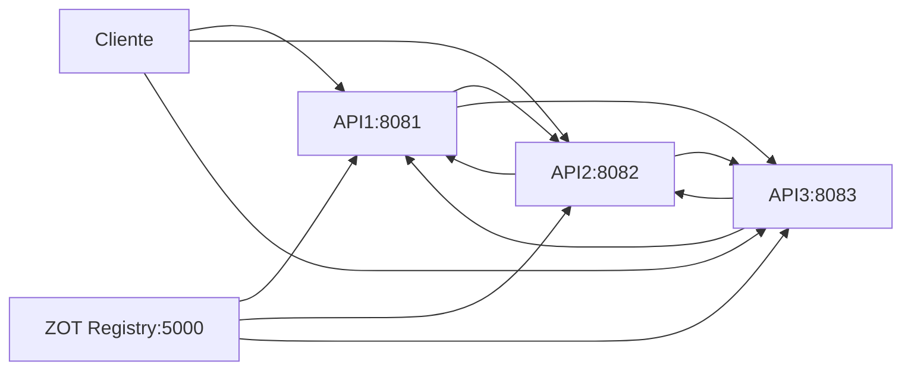

# Manual Técnico
## Proyecto SO1: Desarrollo de Contenedores y Gestión de Imágenes en Entornos Virtualizados

### Información del Proyecto
- **Curso**: Sistemas Operativos 1
- **Universidad**: Universidad San Carlos de Guatemala
- **Facultad**: Ingeniería
- **Carrera**: Ingeniería en Ciencias y Sistemas
- **Estudiante**: Melvin Valencia
- **Carnet**: 202111556
- **Fecha**: Agosto 2025

---

## 1. Resumen Ejecutivo

Este proyecto implementa un entorno virtualizado moderno que integra máquinas virtuales (VMs) y contenedores, empleando tecnologías como KVM, Docker, Containerd, Go y Zot. La arquitectura simula entornos reales de desarrollo utilizados en la industria, enfocados en la contenerización, el almacenamiento de imágenes de contenedores y la gestión eficiente de recursos.

### 1.1 Objetivos Alcanzados
- ✅ Implementación de 3 VMs con diferentes tecnologías de contenerización
- ✅ Desarrollo de APIs REST en Go con comunicación inter-servicios
- ✅ Configuración de registry privado con Zot
- ✅ Gestión completa del ciclo de vida de contenedores
- ✅ Documentación técnica integral

---

## 2. Arquitectura del Sistema

### 2.1 Diagrama de Arquitectura

```
┌─────────────────────────────────────────────────────────────────┐
│                           HOST LINUX                            │
│  ┌─────────────────────────────────────────────────────────────┐ │
│  │                        KVM HYPERVISOR                       │ │
│  │                                                             │ │
│  │  ┌──────────────┐  ┌──────────────┐  ┌──────────────────┐   │ │
│  │  │     VM1      │  │     VM2      │  │       VM3        │   │ │
│  │  │  (APIs 1&2)  │  │   (API 3)    │  │   (ZOT Registry) │   │ │
│  │  │              │  │              │  │                  │   │ │
│  │  │ ┌──────────┐ │  │ ┌──────────┐ │  │ ┌──────────────┐ │   │ │
│  │  │ │Container │ │  │ │Container │ │  │ │   Container  │ │   │ │
│  │  │ │   API1   │ │  │ │   API3   │ │  │ │     ZOT      │ │   │ │
│  │  │ │:8081     │ │  │ │:8083     │ │  │ │   :5000      │ │   │ │
│  │  │ └──────────┘ │  │ └──────────┘ │  │ └──────────────┘ │   │ │
│  │  │ ┌──────────┐ │  │              │  │                  │   │ │
│  │  │ │Container │ │  │              │  │                  │   │ │
│  │  │ │   API2   │ │  │              │  │                  │   │ │
│  │  │ │:8082     │ │  │              │  │                  │   │ │
│  │  │ └──────────┘ │  │              │  │                  │   │ │
│  │  │              │  │              │  │                  │   │ │
│  │  │ Containerd   │  │ Containerd   │  │     Docker       │   │ │
│  │  │ Ubuntu 22.04 │  │ Ubuntu 22.04 │  │  Ubuntu 22.04    │   │ │
│  │  └──────────────┘  │──────────────┘  └──────────────────┘   │ │
│  │         │                  │                     │          │ │
│  └─────────┼──────────────────┼─────────────────────┼──────────┘ │
│            │                  │                     │            │
│  ┌─────────┼──────────────────┼─────────────────────┼──────────┐ │
│  │         │                  │                     │          │ │
│  │    192.168.100.10    192.168.100.11      192.168.100.12    │ │
│  │                      Red Virtual NAT                       │ │
│  │                                
│  └─────────────────────────────────────────────────────────────┘ │
└─────────────────────────────────────────────────────────────────┘
```

### 2.2 Componentes del Sistema

#### 2.2.1 Infraestructura Base
- **Hipervisor**: KVM (Kernel-based Virtual Machine)
- **Sistema Operativo Host**: Linux Ubuntu/CentOS
- **Gestión de VMs**: libvirt + virt-manager
- **Red Virtual**: Bridge NAT con rango 192.168.100.0/24

#### 2.2.2 Máquinas Virtuales

| VM | Propósito | SO | Runtime | Contenedores | IP |
|---|---|---|---|---|---|
| VM1 | APIs principales | Ubuntu 22.04 | containerd | API1, API2 | 192.168.100.10 |
| VM2 | API secundaria | Ubuntu 22.04 | containerd | API3 | 192.168.100.11 |
| VM3 | Registry privado | Ubuntu 22.04 | docker | ZOT | 192.168.100.12 |

#### 2.2.3 Servicios y APIs

**API1** (Puerto 8081)
- Endpoints:
  - `GET /api1/202111556/llamar-api2`
  - `GET /api1/202111556/llamar-api3`
  - `GET /api1/202111556/info`

**API2** (Puerto 8082)
- Endpoints:
  - `GET /api2/202111556/llamar-api1`
  - `GET /api2/202111556/llamar-api3`
  - `GET /api2/202111556/info`

**API3** (Puerto 8083)
- Endpoints:
  - `GET /api3/202111556/llamar-api1`
  - `GET /api3/202111556/llamar-api2`
  - `GET /api3/202111556/info`

**ZOT Registry** (Puerto 5000)
- Protocolo: Docker Registry API v2
- Almacenamiento: Filesystem local
- Autenticación: Sin autenticación (desarrollo)

---

## 3. Tecnologías Implementadas

### 3.1 Virtualización
- **KVM**: Hipervisor tipo 1 basado en kernel Linux
- **libvirt**: API de gestión de virtualización
- **QEMU**: Emulador de hardware para KVM

### 3.2 Contenerización
- **containerd**: Runtime de contenedores de bajo nivel (CRI)
- **Docker**: Plataforma de contenedores de alto nivel
- **runc**: Runtime OCI (Open Container Initiative)

### 3.3 Desarrollo
- **Go 1.19**: Lenguaje de programación para APIs
- **Gorilla Mux**: Router HTTP para Go
- **Docker BuildKit**: Sistema de construcción de imágenes

### 3.4 Registry
- **Zot**: Registry OCI-compliant para imágenes de contenedores
- **OCI Distribution Spec**: Especificación para distribución de imágenes

---

## 4. Flujo de Comunicación

### 4.1 Comunicación entre APIs



### 4.2 Protocolo de Comunicación
- **Protocolo**: HTTP/1.1
- **Formato**: JSON
- **Método**: GET requests
- **Headers**: Content-Type: application/json

### 4.3 Estructura de Respuesta
```json
{
  "mensaje": "Hola, responde la API: vm1 en la vm2, desarrollada por el estudiante Melvin Valencia con carnet: 202111556"
}
```

---

## 5. Gestión de Imágenes

### 5.1 Ciclo de Vida de Imágenes

1. **Desarrollo**: Código fuente en Go
2. **Construcción**: Dockerfile multi-stage
3. **Registro**: Push a ZOT registry
4. **Distribución**: Pull desde diferentes VMs
5. **Ejecución**: Contenedores en containerd/docker


