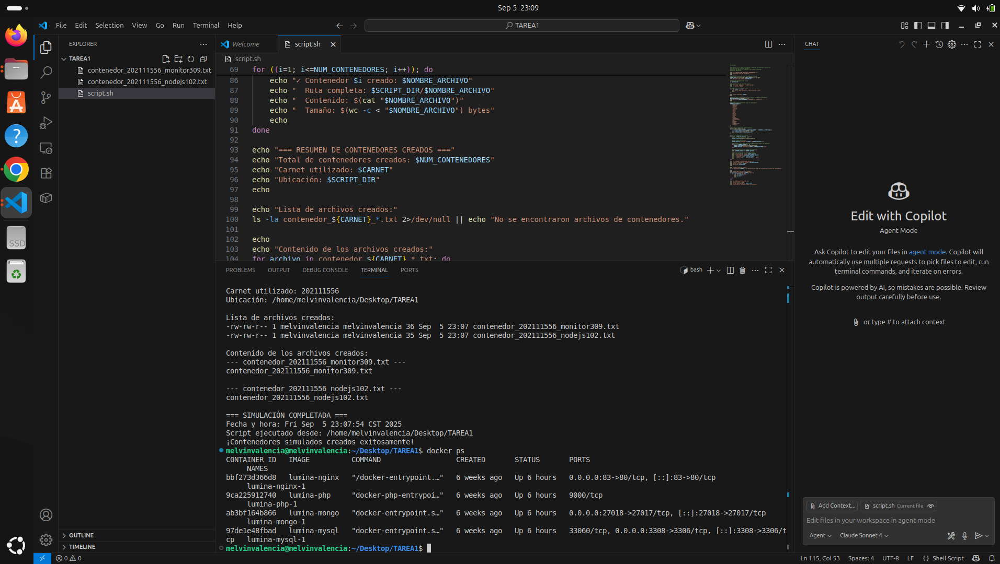

# Tarea #01 - Script Bash para Simular la Creación de Contenedores Aleatorios

## Información 
- **Curso:** Sistemas Operativos 1
- **Carnet:** 202111556
- **Nombre:** Melvin Valencia

## 1. Documentación de Comandos Linux

### 1.1 Navegación de Directorios

#### Comando `pwd`
```bash
$ pwd
/home/usuario/tarea-1
```
**Explicación:** Muestra el directorio actual donde nos encontramos trabajando.

#### Comando `ls`
```bash
# Listado básico
$ ls
simulacion_crear_contenedores.sh  README.md

# Listado detallado
$ ls -la
total 16
drwxr-xr-x 2 usuario usuario 4096 sep  5 10:30 .
drwxr-xr-x 3 usuario usuario 4096 sep  5 10:25 ..
-rw-r--r-- 1 usuario usuario 2847 sep  5 10:30 README.md
-rwxr-xr-x 1 usuario usuario 3456 sep  5 10:30 simulacion_crear_contenedores.sh
```
**Explicación:** Lista el contenido del directorio. Con `-la` muestra detalles incluyendo permisos, propietario, tamaño y archivos ocultos.

#### Comando `cd`
```bash
# Navegar a directorio específico
$ cd /home/usuario/tarea-1

# Ir al directorio padre
$ cd ..

# Regresar al directorio home
$ cd ~

# Verificar cambio de directorio
$ pwd
/home/usuario
```
**Explicación:** Cambia el directorio de trabajo actual.

### 1.2 Manipulación de Archivos

#### Comando `touch`
```bash
# Crear archivo nuevo
$ touch archivo_prueba.txt

# Verificar creación
$ ls -l archivo_prueba.txt
-rw-r--r-- 1 usuario usuario 0 sep  5 10:35 archivo_prueba.txt
```
**Explicación:** Crea un archivo vacío o actualiza la fecha de modificación si ya existe.

#### Comando `cp`
```bash
# Copiar archivo
$ cp archivo_prueba.txt archivo_copia.txt

# Verificar copia
$ ls -l archivo_*
-rw-r--r-- 1 usuario usuario 0 sep  5 10:35 archivo_copia.txt
-rw-r--r-- 1 usuario usuario 0 sep  5 10:35 archivo_prueba.txt
```
**Explicación:** Copia archivos o directorios manteniendo el original intacto.

#### Comando `mv`
```bash
# Renombrar archivo
$ mv archivo_copia.txt archivo_renombrado.txt

# Verificar cambio
$ ls archivo_*
archivo_prueba.txt  archivo_renombrado.txt
```
**Explicación:** Mueve o renombra archivos y directorios.

#### Comando `rm`
```bash
# Eliminar archivo
$ rm archivo_prueba.txt

# Confirmar eliminación
$ ls archivo_*
archivo_renombrado.txt
```
**Explicación:** Elimina archivos o directorios permanentemente.

### 1.3 Visualización de Contenido

#### Comando `cat`
```bash
# Crear archivo con contenido para prueba
$ echo "Este es un archivo de prueba" > test.txt

# Mostrar contenido
$ cat test.txt
Este es un archivo de prueba
```
**Explicación:** Muestra el contenido completo de archivos de texto.

#### Comando `more`
```bash
$ more test.txt
Este es un archivo de prueba
```
**Explicación:** Muestra el contenido paginado, útil para archivos largos.

#### Comando `less`
```bash
$ less test.txt
Este es un archivo de prueba
```
**Explicación:** Similar a `more` pero con navegación bidireccional y búsqueda.

### 1.4 Gestión de Permisos

#### Comando `chmod`
```bash
# Dar permisos de ejecución al script
$ chmod +x simulacion_crear_contenedores.sh

# Verificar cambio de permisos
$ ls -l simulacion_crear_contenedores.sh
-rwxr-xr-x 1 usuario usuario 3456 sep  5 10:30 simulacion_crear_contenedores.sh

# Cambiar permisos específicos
$ chmod 755 simulacion_crear_contenedores.sh
```
**Explicación:** Modifica los permisos de lectura, escritura y ejecución de archivos.

#### Comando `chown`
```bash
# Cambiar propietario (requiere sudo para archivos de otros usuarios)
$ sudo chown usuario:usuario archivo_renombrado.txt

# Verificar cambio
$ ls -l archivo_renombrado.txt
-rw-r--r-- 1 usuario usuario 26 sep  5 10:40 archivo_renombrado.txt
```
**Explicación:** Cambia el propietario y grupo de archivos o directorios.

---

# Capturas del script


